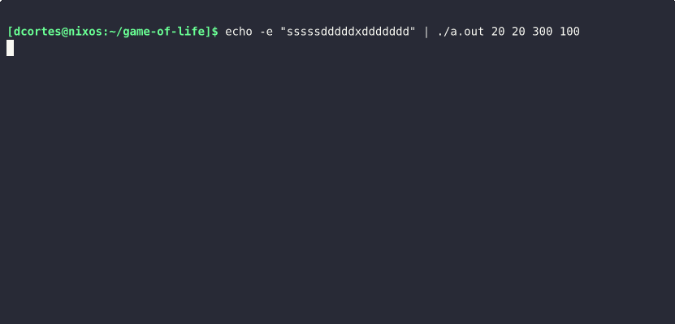

# game-of-life

## About
Simple implementation of the Conway's game of life.

## Use
`echo "sssssdddddxddddddd" | ./a.out <height> <width> <iterations> [<refresh-time>]`

### Parameters
`<height>` : Number of rows on the board
`<width>` : Number of columns on the board
`<iterations>` : Number of game of life iterations
`[<refresh-time>]` : Optional. Refresh interval in milliseconds (ms) for each iteration. 1000 ms by default.

#### Example
`echo "sssssdddddxddddddd" | ./a.out 20 20 100 250`

### Controls
The seed to generate the first board is controlled by a "pen".

- `x` : Activate/Deactivate pen (it "draws" only when activated)
- `w` : Move pen up
- `a` : Move pen left
- `s` : Move pen down
- `d` : Move pen right
